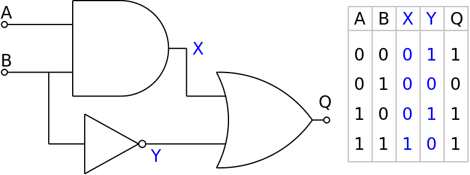

# Circuit Verification with Circom: Building and Testing Basic Logic Gates

## Overview
In this project, we’ll construct a basic logic circuit using AND, OR, and NOT gates in Circom, a popular tool for zero-knowledge proofs. The objective is to create and verify a circuit that, given inputs \(a = 0\) and \(b = 1\), returns TRUE when tested.

## Components of the Circuit

### Logic Gates
We will use the following gates in our circuit:
- AND Gate: Outputs TRUE only if both inputs are TRUE.
- NOT Gate: Outputs the inverse of the input.
- OR Gate: Outputs TRUE if at least one input is TRUE.

The gates will be interconnected to form the final circuit, as illustrated below:

### Circuit Templates
To simplify the coding process, we’ll use predefined templates from [circomlib](https://github.com/iden3/circomlib), which provides ready-to-use components for common gates.

## Getting Started

### Prerequisites
1. IDE: You can use either an offline IDE like [VSCode](https://code.visualstudio.com/download) or an online IDE like [Remix](https://remix.ethereum.org/) or [Gitpod](https://gitpod.io/).
2. Dependencies: Install the necessary libraries using:
     npm install
   
### Installation
1. Clone Repository: Start by cloning this repository to your local machine.
2. Acquire Test MATIC: If your wallet is short on MATIC, you can get free tokens from the [Amoy Faucet](https://faucet.polygon.technology/).
3. Configure Environment: Add your wallet's private key to the env.example file and rename it to .env.

### Building and Deploying

1. Install Dependencies:
     npm install
   
2. Compile the Circuit:
     npx hardhat circom
      This command compiles your Circom circuit and generates the MultiplierVerifier.sol smart contract along with other necessary files.

3. Prepare Input Data: Update the input.json file with the test inputs:
     {
     "a": "0",
     "b": "1"
   }
   
4. Deploy and Verify: Run the following command to deploy the verifier contract to the Amoy testnet, generate the proof, and verify it:
     npx hardhat run scripts/deploy.ts --network amoy
      This script performs four main tasks:
   - Deploys the MultiplierVerifier.sol contract to the Amoy testnet.
   - Generates a proof using the provided inputs.
   - Creates calldata for the proof.
   - Verifies the proof against the deployed contract.

5. Verify Deployment: Check the status of your verifier contract on [Amoy Polygonscan](https://amoy.polygonscan.com/) using your contract ID.

### Project Structure

circuits
├── multiplier
│   ├── circuit.circom
│   ├── input.json
│   └── out
│       ├── circuit.wasm
│       ├── multiplier.r1cs
│       ├── multiplier.vkey
│       └── multiplier.zkey
├── new-circuit
└── powersOfTau28_hez_final_12.ptau
Each circuit is contained in its own directory, which includes the Circom source code and input files. The out directory holds compiled outputs, keys, and proofs.

contracts
contracts
└── MultiplierVerifier.sol
Verifier contracts are automatically generated and prefixed by the circuit’s name.

## Troubling Parts

- Issues with MATIC: Ensure you have sufficient MATIC from the [Amoy Faucet](https://faucet.polygon.technology/).
- Dependencies: Confirm all required dependencies (Node.js, HardHat, npm packages) are installed correctly.

For any questions or issues, feel free to reach out:ararundas02@gmail.com

## Contributors
- ARUN
- [@ArunDas](mailto:ararundas02@gmail.com)

## License
This project is licensed under the [ArunDas] License. See the LICENSE.md file for more details.